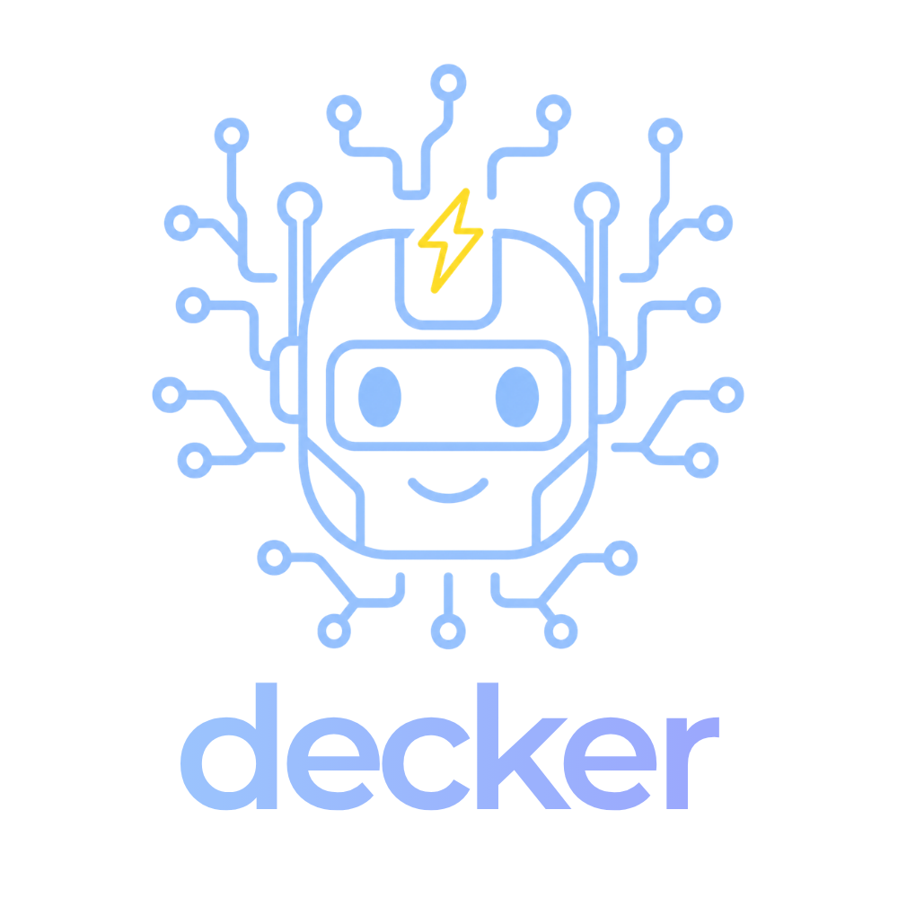

<p align="center">
  
</p>

<p align="center">
  <a href="https://github.com/flashbots/decker/actions/workflows/ci.yml"></a>
  <a href="https://github.com/flashbots/decker/releases"></a>
  <a href="LICENSE"></a>
  <a href="https://deno.com"></a>
</p>

<h3 align="center">Deck your own devnet</h3>

Decker lets you kickstart and vibecode any dev setup with complete freedom — powered by Deno, TypeScript and agent-first patterns!

Rapidly vibehack your own containers and recipes, manipulate commands, plug in any tool you want! ⚡

Own your recipes and features on your fork/revision and run from a `decker.ts` file in your developed project!

Built from the lessons of [builder-playground](https://github.com/flashbots/builder-playground) to spin up Ethereum devnets - but of course, you can compose any dev setup with it!

## Quickstart

Install podman first. If you prefer docker, you can modify recipe targets or override with `--pods docker` flag.

On Linux and macOS, install the latest `decker` binary to `/usr/local/bin` with:
```sh
curl -sSfL https://raw.githubusercontent.com/flashbots/decker/main/install.sh | bash
```

To pin a specific release, set `VERSION`:
```sh
VERSION=v0.1.0 curl -sSfL https://raw.githubusercontent.com/flashbots/decker/main/install.sh | bash
```

Start the L1 recipe:
```sh
decker start l1
```

And you get:

```
  el-1
    rpc        8545
    authrpc    8551
    metrics    9090
  beacon-1
    http       3500
    p2p-tcp    9000
    p2p-udp    9000
    quic       9100
  validator-1  (no ports)
  pg-mb-1
    postgres   5432
  redis-mb-1
    redis      6379
  housekeeper-mb-1  (no ports)
  mev-boost-relay-1
    http       9062

  Pod logs (Dozzle)  http://localhost:18080

  Ctrl+C to stop
```

Do a `decker test` and you'll get a block built.

## Integration

1. Fork/clone this repo or do `decker clone` on an empty dir.

2. Tell your agent to add containers/recipes/features.

3. Commit and push to your fork.

4. Go to your developed/tested project, do `decker init`.

5. Modify the decker file to point to your fork revision hash and recipe.

That's it! And you have dev setup of your own suitable for local runs and CI.

To start your fork's recipe, just `decker start` (or `decker up` + `decker down`) — the pinned source is cloned automatically on first run. Use `decker pull` to clone it explicitly; it never touches an existing clone.

You can run any public recipe (and accessible private recipes) like this.

## Layers

You can evolve `decker` in multiple layers and use in dev or CI setups of your projects:

- **Generators:** Generate your own artifacts/configs dynamically
- **Containers:** Write k8s-like blueprints or host processes
- **Recipes:** Compose containers/processes into a single run
- **Scripts:** Control recipe pre/post states and even launch child recipes
- **Renderers:** Run your recipe on any target (podman, docker, process-compose and anything you want)
- **CLI:** Hack on the clone, run immediately with preinstalled binary

## Why?

Sophisticated tools and their abstraction layers speed up humans but slow down LLM problem solving capabilities and reduce success. In addition, developers often try to fix upstream the tools they depend on, to satisfy their own use-case specific necessities.

We eliminate this friction by inverting the approach to an inclusive one:

- Simple building blocks and scalable patterns for LLM agents and humans

- Relying more on LLM training data instead of heavy custom logic and abstractions

- Putting users in control of features instead of restricting to an opinionated and limited selection

- Leveraging readily available community tools
